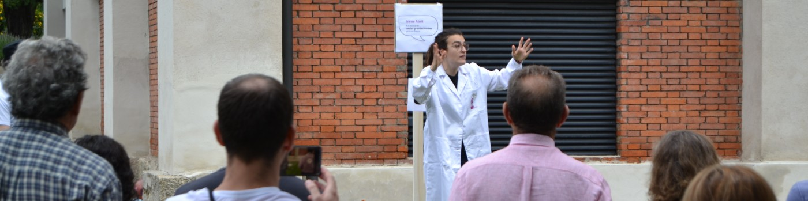

### ¡Hola 👋!

<!--
**iabrilcabezas/iabrilcabezas** is a ✨ _special_ ✨ repository because its `README.md` (this file) appears on your GitHub profile.

Here are some ideas to get you started:

- 🔭 I’m currently working on ...
- 🌱 I’m currently learning ...
- 👯 I’m looking to collaborate on ...
- 🤔 I’m looking for help with ...
- 💬 Ask me about ...
- 📫 How to reach me: ...
- 😄 Pronouns: ...
- ⚡ Fun fact: ...
-->

My name is Irene (pronounced /ee-deh-neh/, she/her/hers). I am a scientist passionate about Cosmology, outreach and diversity. My work currently focuses on studying the afterglow light from the Big Bang to learn more about the very beginning of the Universe and the subsequent distribution of dark matter across cosmic time.
